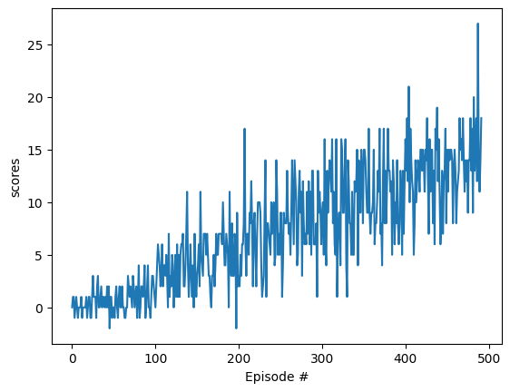
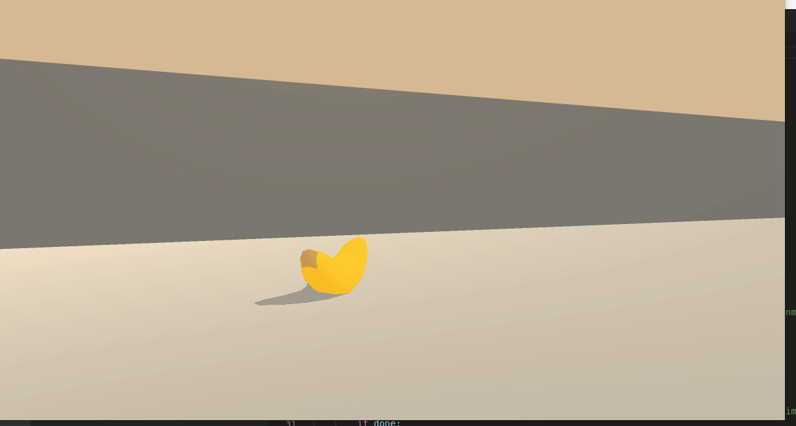

# Report
This project involves training an agent to collect yellow bananas while avoiding blue bananas in a square world. The agent recieves a reward of +1 for collecting a yellow banana and a reward of -1 for collecting a blue banana. The goal is to train the agent to collect as many yellow bananas as possible while avoiding blue bananas. The environment is considered solved when the agent achieves an average score of +13 over 100 consecutive episodes.

Description of files in the following table:


| File | Description |
| --- | --- |
| `train.py` | The main file used to train the agent. |
| `dqn_agent.py` | The file that contains the agent class. |
| `model.py` | The file that contains the neural network class. |
| `checkpoint.pth` | The file that contains the trained weights of the neural network. |
| `run.py` | The file that contains the code to run the trained agent. |


## Learning Algorithm
To solve this project, a Deep Q-Network (DQN) is used. DQN uses a deep neural network to approximate the Q-function. 
The input to the network is the state vector $s$ and the output is a vector of Q-values for each action $a$.

The loss of the network is calculated using the mean squared error between the predicted Q-values and the target Q-values. The target Q-values are calculated using the Bellman equation:

We want the Q-values to satisfy the Bellman equation:
$$
\hat{Q}(s,a) = r + \gamma \max_{a'} Q(s',a')
$$
where $s',a',r$ are the next state, next action, and reward respectively. $\gamma$ is the discount factor.

And the loss is the mse error of the desired value, and the current Q-value $Q(s,a)$:

$$
L = \left( \hat{Q}(s,a) - Q(s,a) \right)^2
$$

However, there are some problems with this network, and it may not converge to the optimal policy without additional twicks. There are two main reasons for this problem. The first is because the network is learning from its own predictions (as result of taking predicted actions). This means the training data is dependant in current state predictions. This can lead to a feedback loop, where the network will diverge. Another problem is that there is a high correlation between the current state and the previous states. This can lead to the network overfitting to the current state, and not learning the optimal policy. The authors of the paper proposed two solutions to these problems:

> ***Fixed Q-Targets**: to break the dependancy of between ouput (actions) and input (the next state is a result of action taken), we use two networks. The first network is the one we use to **predict** the Q-values. The second network is the one we use to **update** the Q-values. The second network is a copy of the first network, but its parameters are updated less frequently. This helps to break the feedback loop, and helps the network to converge.*

> ***Experience Replay:** Instead of learning from the current state, the network learns from a random sample of previous states. This helps to break the correlation between the current state and the previous states. In practice, tuples of $(S_t, A_t, R_{t+1}, S_{t+1})$ are stored in a circular buffer. While training, we occasionally sample a batch of tuples from the buffer, and use them to train the network.*


Both of these techniques were applied during training.

### Network Architecture
The network is composed of 4 fully connected layers. The first layer takes the state vector as input, and outputs a vector of size 128. The second layer takes the output of the first layer as input, and outputs a vector of size 128. The third layer takes the output of the second layer as input, and outputs a vector of size 64. The fourth layer takes the output of the third layer as input, and outputs a vector of size 4 (the number of actions). The network uses the ReLU activation function for the first three layers, and no activation function for the last layer. 

```python
class QNetwork(nn.Module):
    """Actor (Policy) Model."""

    def __init__(self, state_size, action_size, seed):
        """ Initialize parameters and build the model
        Params
        ======
            state_size (int): Dimension of each state
            action_size (int): Dimension of each action
            seed (int): Random seed      
        """

        super(QNetwork, self).__init__()
        self.seed = torch.manual_seed(seed)

        self.layer1 = nn.Linear(state_size, 128)
        self.layer2 = nn.Linear(128,128)
        self.layer3 = nn.Linear(128,64)
        self.layer4 = nn.Linear(64, action_size)

    def forward(self, state):
        """ Build a network that maps state -> action values """
        x = F.relu(self.layer1(state))
        x = F.relu(self.layer2(x))
        x = F.relu(self.layer3(x))
        output = self.layer4(x)
        return output

```
### Hyperparameters
```python
BUFFER_SIZE = int(1e5)  # replay buffer size
BATCH_SIZE = 64         # minibatch size
GAMMA = 0.99            # discount factor
TAU = 1e-3              # for soft update of target parameters
LR = 4e-4               # learning rate 
UPDATE_EVERY = 4        # how often to update the network
EPS_DECAY = 0.995       # decay rate for epsilon
MIN_EPS = 0.1           # min value of epsilon
MAX_T = 500             # max number of timesteps per episode
N_EPISODES = 2000       # max number of episodes
```
After experimenting, the two most influential parameters found were the minimal epsilon, and the maximal time steps per episode. Running an agent trained with more time steps for each episode, caused the output agent to oscillate around some of the blue bananas (stuck in local minimum). So it was important to force the agent to explore more actions (higher $\epsilon$), and not to waste time (shorted episodes).

## Plot of rewards



The success criteria of the project is to achieve an average score of +13 over 100 consecutive episodes. The agent was able to achieve this after 392 episodes.

And here is the result of running the trained agent:



## Ideas for Future Work
1. To avoid the perceived oscillation blue bananas, we can train the agent with a state vector that includes pervious states as well. For example, the last 4 states. This will help the agent detect the oscillation, and avoid it.
2. Additional twicks to the classic DQN algorithm can be applied, such as Double DQN, Dueling DQN, and Prioritized Experience Replay. These twicks can help the agent learn faster, and achieve better results.